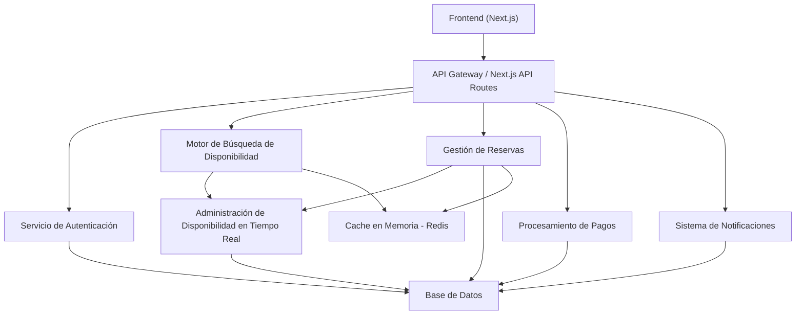
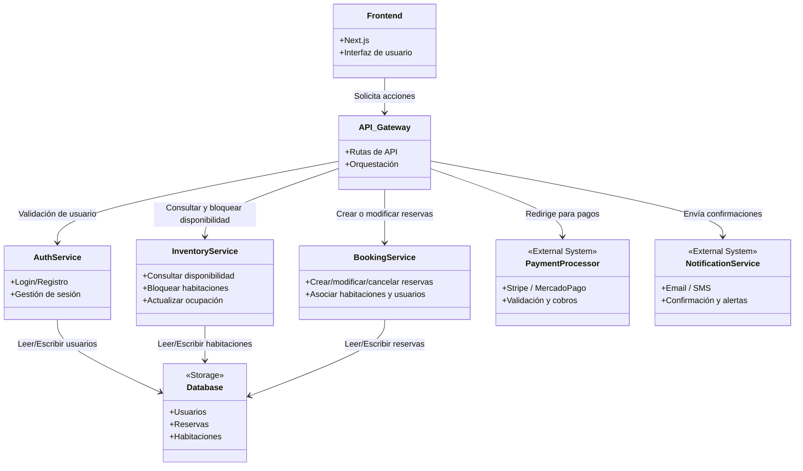
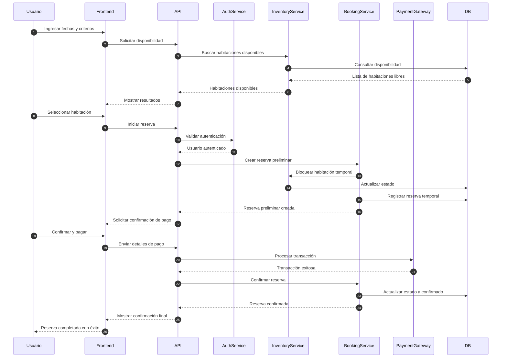
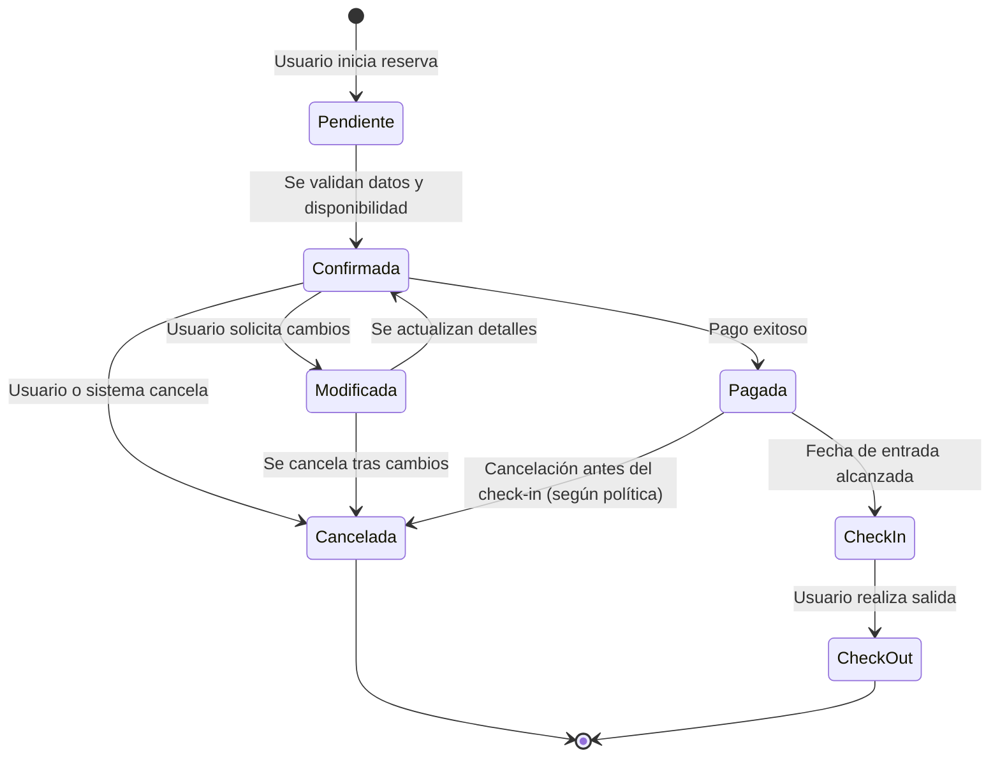
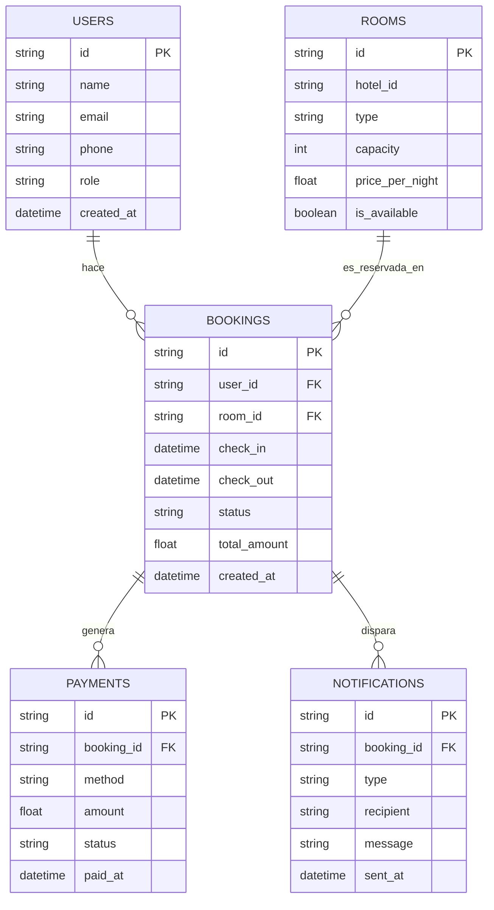

# Diagrama de Componentes del Sistema de Reservación



# Diagrama UML de Componentes del Sistema de Reservación



# Diagrama de Secuencia UML



# Diagrama de Transición de Estados



# Estructura del Proyecto (monorepo estilo fullstack con Next.js + backend modular)

```text
/hotel-booking-system/
│
├── /apps/
│   ├── /web/                   # Frontend (Next.js app)
│   │   ├── /components/        # Componentes UI reutilizables
│   │   ├── /pages/             # Rutas y vistas
│   │   ├── /styles/            # Archivos CSS/Tailwind/config de estilo
│   │   ├── /utils/             # Helpers o funciones comunes
│   │   └── /public/            # Assets públicos
│   │
│   └── /admin/                 # (opcional) App de administración interna
│
├── /packages/
│   ├── /api/                   # Lógica del backend (API Routes o serverless)
│   │   ├── /auth/              # Servicios de autenticación
│   │   ├── /booking/           # Creación y gestión de reservas
│   │   ├── /inventory/         # Control de disponibilidad de habitaciones
│   │   ├── /payments/          # Integración con Stripe / MercadoPago
│   │   ├── /notifications/     # Emails, SMS, etc.
│   │   └── /users/             # Gestión de perfiles y roles
│   │
│   ├── /db/                    # Prisma ORM, migraciones, seeders
│   │   └── schema.prisma
│   │
│   ├── /lib/                   # Código compartido (validador, logger, helpers)
│   └── /types/                 # Tipos TypeScript globales
│
├── /infra/                     # IaC: Terraform, Docker, etc.
│   └── /nginx/                 # Configuración de reverse proxy
│
├── .env                        # Variables de entorno (dev)
├── docker-compose.yml          # Servicios locales
├── package.json
├── tsconfig.json
└── README.md
```

# Diagrama Entidad-Relación


